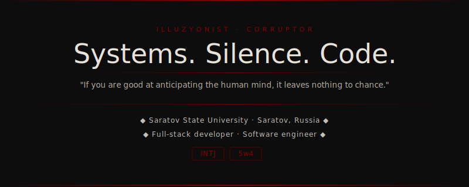

  

 

🏠 **Location:** Saratov, Russia 🇷🇺  
🎓 **Education:** Saratov State University (SSU)  
💻 **Role:** Full-stack developer & Software engineer  
🧩 **Type:** INTJ | Enneagram 5w4  
💚 **Psychology:** Generalized PD & Social PD & Obsessive-compulsive PD

---

### 🧠 Mindset & architecture

* 🧬 **On people:** Useful while necessary, interesting when complex, irrelevant otherwise
* ⚙️ **On work:** The system either works or it doesn't — and I don't sleep until it does
* 🔍 **On thinking:** I prefer to understand a problem completely before touching it — depth over breadth, structure over everything
* 🎯 **On projects:** I gravitate toward unusual and complex problems — the kind that barely exist in the open or don't exist at all
* 🕸️ **On architecture:** I enjoy building layered infrastructures of interconnected services and breathing new life into old projects through remakes
* 📝 **On documentation:** I tend to ship first and document later — READMEs get written when there's actual time for them

---

### 🎭 Beyond the code

* 🎮 **Wolvesville:** Chess with living pieces — the only game where reading people is the mechanic
* 🕹️ **Geometry Dash:** Pure rhythm and precision — where muscle memory becomes the language and flow is the reward
* 🔫 **PUBG Mobile:** High-stakes survival where every decision is irreversible and the last circle decides everything
* 🎬 **Cinema & books:** Detective thrillers, crime fiction, psychological mind games
* 🏐 **Sport:** Volleyball, table tennis, gym, calisthenics
* ✍️ **Crafts:** Writing, music, card tricks
* 🌍 **Languages:** 🇬🇧 English — B2 &nbsp;|&nbsp; 🇹🇷 Turkish — A2 (in progress)

---

### 🗺️ Plans & ambitions

* 📱 Ship my first applications to Google Play
* 🏗️ Go deeper into software architecture and system design
* 📚 Master C, C++, Scala, and Elixir at an advanced level
* 🚀 Push as many services to production as possible
* 🌱 Revisit, refine, and extend existing projects
* 🛠️ Keep building — more, better, deeper

---

### ⚡ Technologies

**Operating Systems**

&nbsp;&nbsp;&nbsp;&nbsp;&nbsp;

**Languages**

&nbsp;&nbsp;&nbsp;&nbsp;&nbsp;&nbsp;&nbsp;&nbsp;&nbsp;&nbsp;

**Runtime & Frameworks**

&nbsp;&nbsp;&nbsp;&nbsp;&nbsp;

**Frontend**

&nbsp;&nbsp;&nbsp;&nbsp;&nbsp;&nbsp;&nbsp;&nbsp;&nbsp;

**Data & Automation**

&nbsp;&nbsp;&nbsp;&nbsp;&nbsp;&nbsp;&nbsp;&nbsp;&nbsp;

**Infrastructure & DevOps**

&nbsp;&nbsp;&nbsp;&nbsp;&nbsp;

**Messaging & Bots**

&nbsp;&nbsp;&nbsp;

---

&nbsp;

---

[![corruptor.pro](https://img.shields.io/badge/corruptor.pro-0d0d0d?style=for-the-badge&logoColor=white&logo=data:image/png;base64,iVBORw0KGgoAAAANSUhEUgAAACAAAAAgCAYAAABzenr0AAAH7ElEQVR42n2Xy29dVxXGf2vvfc59+bp2YsdxHo2p2rQpIoSqQKtSlQlITJAQYsZDHTLhb+iECQyYM2GEQCAhBEJUFKoiQUUfFFCrRCHk0caJE7t2fa99H+ex12Jwzr2+dgpHOrr3nLP3Wmuv/a1vfVu+eXzRDAADBAQmj5O/s68nIwHUQDEiYGaIgBg4EUTqSVaNr51gGKjhEEQgGAdezAxRDntjxshMnJhhgJpVgZhVjqmCcszMmfllxrwTCKY2tTkdUI8WqSKffHe1mVInDsEjBIESiFbNkSPOpvZn7Er9LshR53VqwKpB9eAS2I+V07ZzRIMRRmHKXqm0nXA8eMyqQNzEqBxOp0x8TDLgnRzOz0wgk6sQ6KtyuyjoReVEs4Ei7CmUJgxLQyxyKiorwbMQPPtFZC543AwWDgdRXcGLq4BxBGKC4ICdGOkBG3lB9CmNJGFLhTR4SlPMjIZPETFuFyN2UJbFkcZIIkLqBCcyxYQcQULA7IEtoAaTF9jOI9fzAsTR8B6LQlRjWBYMy0gRI+0kEBykrgEO7paRRedoxMg8nvngqqXNZqFOTAjeYWbYBG2AA0qMf48ybucFBUI0YTQscOQEEcYxYk5IvTAoxhRmFaAyRyPx+NQzLDPOGTzkPSYzuACkfgiHUiIHm+CB1SQB4F+jMWZK0wq6Fvlkq0GzHbgxGHO/jCwHT0uMy3kkF4eUKdvReLzlOZsklKYkzh3KAFpjQNWmvu0IGpeDJxXh3eGIvhZ0EB5y8ORimyeWutxa3+bmcEyRelziiTsDLltkGDOazjOMwl/yIeeShMeSFlmsMOPkgJT80925l5yrmMvN3gglMOc9x0KgZ/DpE8tsFPCP3og0E8wnvLo/5u/jSDTPpaU5NvLIfhTmvLCV52QGJ5NAdwL2mbI0IJgqVoNuysJ1rhyQq7ISAs+uHOdMt01SKKMy5fOPn+FMp0F+dZ2BGo8vzbG80ODye+t0Bhl9LWh5T2kVVYsT9AgInUi9BVjF3R/Pwjhg2XtWOi0eXWuQZSWnV5doNgIv5AXnnjhLjrJxf4fnTyzy+p1N7gwibe8ZRWVPhMQ7yiIeKkYzw1nt9eM422bwoqOMAuHsiUVy5/jl21d55fIHxDRlNMoZjkp2Phpya3/Am3sDchxjAxPhfpYzLiLGQd+Y3GGWFGwGpiKCqoIIzgllXtAbZ9wd55Q+sNJpc251mfZyl/3xiPFgzN1Rxq/WN5nznuU05XQz4XjwzNddTxWCF8RgFCPiBHlx6ZjJlIIMq9uwc0KMiqoRgkdVSZYW8c7Bfk4jQuKFvhWcWOgQUs/O3pC/bWwTMc532gwEPioj23lJv4xgSts71lotzjqh1EhwIod61gQDURWto9E6M2Vvj16zyUIzJUkCnUaCK3OubO2QqKKtwHvDEWPgnWFGtApfXhxB6gUC14ZjTqUJX2i3JnrAqv5uVW0KgtaQ9XWJGiBZQQasl5GwpzSDIysyhv09vnjhFFtlJNkMxDziBFy9HDWbckwQoSnCepbzmhlhSoAitQqq27E4VA2rMYDCy/v7LGiDp7ptPuj3sSwnUeMrz53nkXPHOd8bsBmNn16+Q3AeVUOnBS5TEZKI0PSBHfUEd0BLiBwoHIDgBC9CA3h1MGC9LJnXhDkPD8816Bzv8NyzF3j40ZNcef8ev77+Ia9d30YkoVR5oP9BxQU5glilCkIZtYJf3ZC8CIkIhRm9MnInRjbygvWiQIBUIE083fZDLD16hj8PSt76xRtcvr1DnucI/kgRG0cFgZlCzYzynaVFEwOrU9OPypVxzr0islsqhelUHQE0vGcuJOTO0R/lQF5TVUIQmQLvf19Wd4EaE6YV0SQiDIHf9QYMYkXEIh4v/mCawTjCOCoQcTica02zF6c8IkdWLjMS9XA2gmIkTkiC44+7AwZRSFyokXvQIc1AxBGcq8pVQE2Jsfw/K7ZDqz4seyo7oZl4tqPyZm/EnbHiJVCa1fLFEKlCcC4QtUBjcUQ7pjx4avg4XTz56gBFcFXBr7Xatp5FShUqfXhAyRNZHnxCEUecOnmWF7/9dU6urrDb3+ONN9/h5ZdfQ2NZgaqWdwc7PLslWhORr7vLlPQ65qRtXjrmaJuTjol0zEnHvHStkSwapPb0pWfsnb/+wXbvX7PNO1etv33Lels37Ec//IFJsmjOzZuTOXN0LPiuedexdvuYpY15g4ZB04TUoGnQMKFhQmo+SPOlA4y7inio5FPSSFGLPLK2xk9+/H1On1lltz9gnOXkMVKa8dTFC3z41rv88+ZNxAe8dyRJ4PTpVQaDAeNxNt0SwR48HeksMMRVzgEfPMF7RIQXnvssqyeXUKuaVAiOmOdsXr3B5t17fOMz5/lap4lrtohlSavV4uatD8jGBUmSzuy/PABTVyFc6vPfwe6pKnlR0Go22dvfZ7c3oNcfEDASEbLRmKu/fYWPrlxj9atf5ksXn+DJ+Q4XLn2KTrtFq9Wikaa0Ws3a9azqmpHCjm595tS6ETmcCGqRixefZGtzm+5ci/4gZ2Ghy/e++y2e+dwlQpJQAnmW85/bd2m+f5u3f/4bfm/C9Ws32Nvv411ANR7hgVhr7rrKHB1j2ignYqQ6x6x94jTHFhbY7fW5df19SnI6rQXWHj7F/OI8m/e3UYW797d4bGWZLwal+fwz/OxPr7O5ca/WEgGNSjkt3zhJPIbxX4pXLSC5FgmlAAAAAElFTkSuQmCC)](https://corruptor.pro)&nbsp;[![hisphere.ru](https://img.shields.io/badge/hisphere.ru-0d0d0d?style=for-the-badge&logoColor=white&logo=data:image/png;base64,iVBORw0KGgoAAAANSUhEUgAAACAAAAAgCAYAAABzenr0AAAIh0lEQVR42u1XW4ycZRl+vsP//3Oe2WO7Ld1COW9FSBHDwVAxFiOJMagzJqhXxChceEjQG6PDEE284pBoo8YTaozuIAlIQBFZloQAAUNt7RbKtp3d7c7uzu7OzD/zn7+TF9uFloIF9cILn7sv+b68z3v63ucF3iWMMXRqaoqf697U1BQ3xhD8t2CMIZOTk+y0s33cjS49uti9+WBj+fMn2sFtJ9aD65aMGaWnmT315pxEyLm8JoRoAGisRRNHGs0vhGH8mThOdnHLoZbFUMilQaBgUfS6XnBsIJ958PqJ8QcJId1NBwgh5j0TmJycZJVKRRljBqcPzd+zsNT+YnMtsPueD7fvo5BL6+0jBR0LDbfvM8fmhHEHIMCWkr24c9vQvXuv3PUAIURVq4bWahuOvCsCm8Yff+7QNUvr4e+Xu9EFJxeXMTyQlUEkqDSEZByLaA0QQmFxgq7rm/WuZ8a3DeokjjnjFnZuzT0zMFoof+6mD6y9E4mzCJQnJ1m9UlE/feyFmzrd4NGFpXZupdWRI0NFFsSCUMYxUMyBMQohFRhjiGOBJFGAETBSgFOYdrcnIwHrwh3DBz5x05U337jnktVqtUprtdoZJM6o6mrV0FqFqF88+txlzZXOo6/OLuZW1rpq25ZhHscSfS/Czu0jKOYzCMIYfphgeLCAy3eNwfNDHDgyh6XlDkaKNokTba2tdUUUx1d5YfTw1IkT+/Z/8yXx1pqgZ0bjbhhj+MGjS7967qWZnJZCElA222hiac1FmCiMbR3Cpz52LQyhcGwOizFct2cClDIsNNsACOYWO+i4Hjo9z3IsKtpu+KHHH3r+3nq9oiqV+uk23yRQrVZZrVbT37j34dvjRF/Tabvy+NwS77ouCAApBWxO4QUJ4kQjSCT8SEFpoOfFiIVCKe+AESCIYlBKUMg6WF5e5Sdmj8vG4vqXv/bdX++p1yuqXH6zrd8gUKvVVLU6xVut1bsaJ+aMUpqurHbguh6klBBxjI7bR6I0okSBc4qUzWGgIbWBVBqeH6K11oVWGn4Qod12sdJqEyEllNSk1e1/e8Na/cwaKJcnWb1eUUvy+LVuz7+oubSsQRgdGSwhFAq+HyGMFKhtIU4UtOG45carQQlAKIUBhUgk4kQim3FAYcNogcUwgM0pAj9ks8cXMDw8uO8jt39vS/1n31qBMQSEGAoArYnDBAC8IL7BDxX8INJpm4HAIEkEKCNIOxzEaCghILTC0cYyXnl1DodfX0CSSCitIYSA0Rrtjov5k6vQSoNRAkIICYNQBaHI6tBcCwDlU7Ww0QXPbISj3e1eZjQAo+H2PAgFZLJZhGEEKTUMJVBKQSQJXnzlVUghwS2Oi8Z3QAiNXt9H1uEYKuVglIRKAnh+AotTlHKWyWZSSKetqwA80mptOM0BYHp0xgDAWmt9aywBCkLW3QADhQwsSpAQIJdNodPz0fcCJFIjCEJ0Oh6yuTRiIRElCfLZNIwS6HkBEiEglEEplwYANJtr8BOOTC5tn9UFZZQBAJbFXUoJOIMpZlNYb/cx32yBGI0ojJHEAlIkAGXouh7iJIFWElJrgFD0+wHabRdrnT7WOy6kEIjiGEGUwHJsMEZhlGRnfUSb4RCatBjlaHUCSG0wOlyA4zhodfqwogSjI0N47WgDv5l8DHEUQ2uN1dU2Hn7saXQ6LqIohpICw6U8dBIjikK4XoCRgTxSlgMpJGIRN9/2HwAA22Yv+r6H4YEMSadsdFwPnDNkUjYIJVhtd5F2OGZnG5ibX4LreuCc49ixBlZW1hHFMcIwxPLyKvwggJAKKduCVAbtrk8ci4MQevL0tG/UwIehMQ0MF/hU3KdxIpVDjDL5XJacf8FORELBSXHYto3dE5dgdnYO3LKw3uljz5WX4R8zr6Pb7ePCXedBiQiOY4FShkOHjmBlsQmbpeDYnEoRyWI2dwgAMDFhAGAjH9PTBtUqPfrAPb3hnXv2RbEcty2mo0TS3e+/AqNbRqGUQa/vww8jXHD+OLLZNLZuHUan6yOdtnH1nvchnbKRcmxEscSO8fMwP7+AbtuFbXFlMU4Ypc8eePKB+1CtUpwaSm8Mo73PgE4bo0v5zA+NiW+M4sDEscLM4SPQWiOXz8EYA8dx0GgsYMf4djz/witYX3cBaLz88kGkUjbWWm2srXewc3wMc415cE6hlTLpbIEwqPvfsAXos8dxtUqruBt/ePbOZ2NpbnB7rkq0ZkpqZNMpCEOgtcbgYBEjo6N47egxFHIZeH4ASiiklLA4A6UUPc9DKZ/BYDEvhaTc5vTPB5+87+OVSoXW63X1tkWImRlSqxHtpOgdjJNkoFgAtNHDg0WAEDBikE47iKMEJxeayGczkFKimM/Bti1YFsPYaAlCKVicgTOuuv2YU0ZXc/nslwghqJ/K/SbYWwiYcrnMnnrkl8vbL76+AW5/mhpNAKOE1DQREkIIJEIAhMJsiD6EUYIoikAJgRfGCHwfGduS2XyRF0pFsX3byCenf/udA+Vymc3s36/fmQCAmZkZUy5Psqf/eNffL7/6o6+nMrlbYmlsLYRkjBoARBtDHNsCCOD7ARIpwGAAo43NLc0oM6Nj5/HCwMDS2Laxz/7pJ19/amPg1dS7FqXlcpnV63V16x33X7PS7v2g54UfDMMQUeCDWbYKg8AQQmFZFoyR0MoQzjkrDY2AEIJCPvfQpRfv+OrPa7c1N6fte5ble/dW+fR0TU5NTfHv/+5AWUtTcXvePkN41rIsCKnBuQPHZlBSgFMdEm791bGs/U/86M4nTh/1/9ZecEopnSEkv3L/X8ZbS6tXSCV2dd2uQ0CtUrEQJ4mY2zow9Lcf125tnHpJYe42+Bc7wXsB2ZBRVXruq1V6uuT6jzajd4rIzMxusiliNjE6s9tMTBw2b5Xd/8f/PP4JqJ3GKlreQpIAAAAASUVORK5CYII=)](https://hisphere.ru)&nbsp;

📜 All open-source code is released under the [GNU AGPL v3.0](https://www.gnu.org/licenses/agpl-3.0.html) license, unless stated otherwise.

